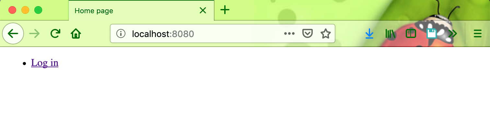
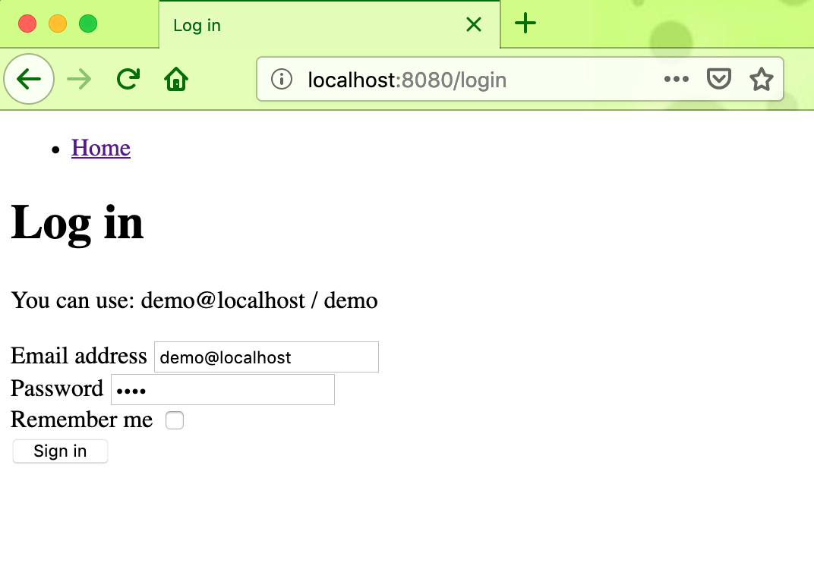
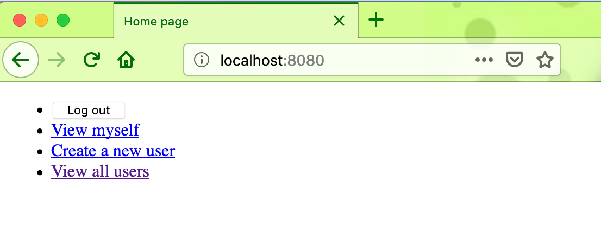
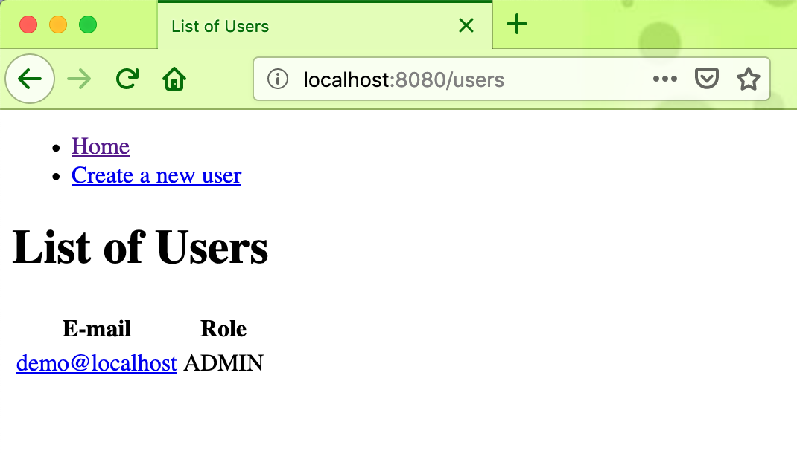
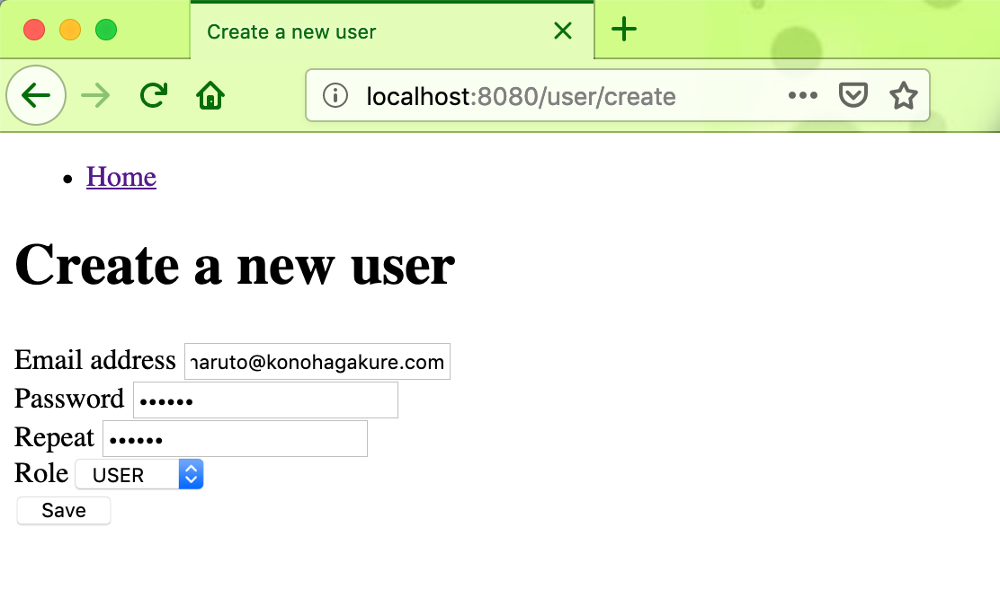
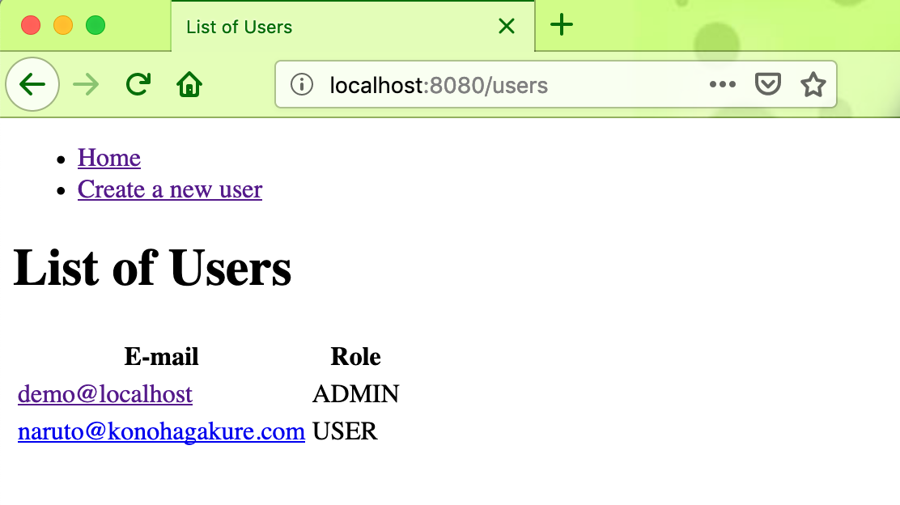
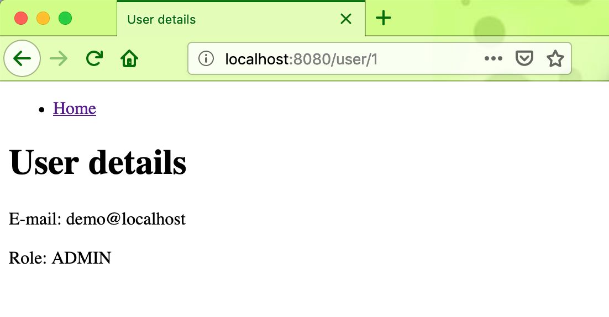

Example Spring Boot Security
============================

The application showing how to use Spring Boot with Spring Security for common needs, such as:

* Customized login form
* DAO-based authentication
* Basic "remember me" authentication
* URL-based security
* Method-level security

See the [Spring Boot Security Application](http://kielczewski.eu/2014/12/spring-boot-security-application/) article for
commentary.

Requirements
------------
* [Java Platform (JDK) 8](http://www.oracle.com/technetwork/java/javase/downloads/index.html)
* [Apache Maven 3.x](http://maven.apache.org/)

Quick start
-----------
1. `mvn clean spring-boot:run`
3. Point your browser to [http://localhost:8080/](http://localhost:8080/)

Screen shot
-----------
Index Page

Login Page

Menu Page

List Users Page

Create New User Page

List Users Page

User Details Page

